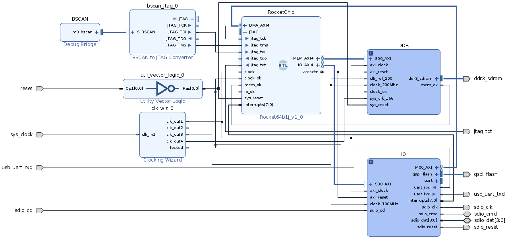
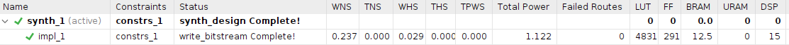
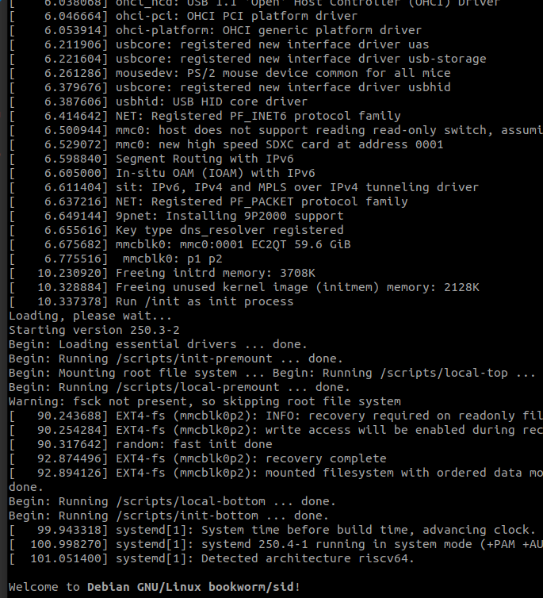

# riscv-ml

# Machine Learning project using RISC-V and NVDLA on Linux

`ricv-ml` project contains FPGA prototype of functional RISCV core able to :
- run Linux rootfs build with riscv toolchain ( from `SDCARD` )
- connect to SDCARD core
- connect to DDR3 
- connect to NVDLA core ( not tested )
- run nvdla driver on Linux ( not implemented )
- run ml projects ( not implemented )       

`RISCV` core was generated with https://bar.eecs.berkeley.edu/projects/rocket_chip.html 
and was configured for `RochetChip` version with virtual memory , i$ and d$.

Github project for `RocketChip` : https://github.com/chipsalliance/rocket-chip/blob/master/README.md

Github project for `NVDLA` : https://github.com/nvdla

## Content
* `gen_linux_img` - steps to build Linux for RocketChip  
* `img` - diagrams  
* `ip-cores` - ip cores teste with RocketChip  
* `nvdla` - rtl for NVIDIA Deep Learning Accelerator ( `NOT` connected to RocketChip )   
* `qmtech_board` - Vivado board configuration
* `vivado_proj` - RocketChip project ( constraints & ip cores )

## HARDWARE
* `board` [Qmtech Wukong](https://www.aliexpress.com/item/4000170042795.html?pdp_ext_f=%7B%22sku_id%22:%2210000000580064636%22,%22ship_from%22:%22%22%7D&gps-id=pcStoreJustForYou&scm=1007.23125.137358.0&scm_id=1007.23125.137358.0&scm-url=1007.23125.137358.0&pvid=4f6ae3d5-2b2c-43c7-8916-4ec125e11283&spm=a2g0o.store_pc_home.smartJustForYou_482569341.3) :
  * `fpga` - XILINX XC7A100T ( 101,440 LC )
  * `ddr3` - MICRON MT41K128M16JT-125:K, 256M
  * `spi ` - S25FL128L,16M
  * `eth ` - RealTek RTL8211EG
  * `clk ` - 50 MHz  

## SOFTWARE
* `EDA` - Vivado/Vitis

## IP CORES
* `axi4-uart`  - AXI4 UART
* `sdc`  - AXI4 SDC controller
* `ddr3` - AXI4 Xilinx MIG  /  from Github project [DDR](https://github.com/buttercutter/DDR/blob/main/README.md)

## BUILD Linux
* README in folder `gen_linux_img`
  * Follow steps from github project [fpga-rocket-chip](https://github.com/cnrv/fpga-rocket-chip)
  * Append content of `DTS` file ( vivado_proj/bootrom.dts ) from step [1.3 Preparing the project ](https://github.com/cnrv/fpga-rocket-chip#13-preparing-the-project) 

## BUILD Vivado Project
* Add wukong target to Vivado 
* Project contains following components :
  * RocketChip cpu
  * DDR controller
  * IO : SPI & SDC & UART
  * PLL
  * BSCAN

* Generate project
  * cd <path>/vivado_proj
  * vivado -mode batch -source riscv-ml.tcl

* Check memory address :

| IP core | ADDRESS |
|-|-|
| RocketChip/DMA | 0x0000_0000 |
| IO/SPI | 0x44A0_0000 |
| IO/UART | 0x6001_0000 | 
| IO/SDC | 0x6000_0000 |
| DDR/mig_7 | 0x8000_0000 - 0xFFFF_FFFF | 

* Block Design :

* Top design is `riscv-wrapper.v`
* Generate bistream

## RUN Linux
* Check folder `gen_linux_img`to build Linux and create sdcard
* Boot log :

## NVDLA 
* Project is NOT tested or connected to RocketChip
* linux driver - https://github.com/caihuoq/nvdla
* rtl - folder `nvdla`
