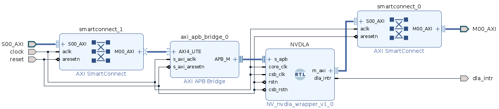

# NVDLA wrapper

The [NVIDIA Deep Learning Accelerator](https://github.com/nvdla/hw) (NVDLA) is a free and open architecture that promotes a standard way to design deep learning inference accelerators. With its modular architecture, NVDLA is scalable, highly configurable, and designed to simplify integration and portability

## HARDWARE
* `board` [Qmtech Wukong](https://www.aliexpress.com/item/4000170042795.html?pdp_ext_f=%7B%22sku_id%22:%2210000000580064636%22,%22ship_from%22:%22%22%7D&gps-id=pcStoreJustForYou&scm=1007.23125.137358.0&scm_id=1007.23125.137358.0&scm-url=1007.23125.137358.0&pvid=4f6ae3d5-2b2c-43c7-8916-4ec125e11283&spm=a2g0o.store_pc_home.smartJustForYou_482569341.3) :
  * `fpga` - XILINX XC7A100T ( 101,440 LC )
  * `ddr3` - MICRON MT41K128M16JT-125:K, 256M
  * `spi ` - S25FL128L,16M
  * `eth ` - RealTek RTL8211EG
  * `clk ` - 50 MHz  

## SOFTWARE
* `EDA` - Vivado/Vitis

## IP CORES
* `nvdla`  - https://github.com/ucb-bar/nvdla-wrapper

## BUILD Vivado Project
* Add wukong target to Vivado 
* Project contains following components :
  * nvdla wrapper
  * axi bridge

* Block Design :

